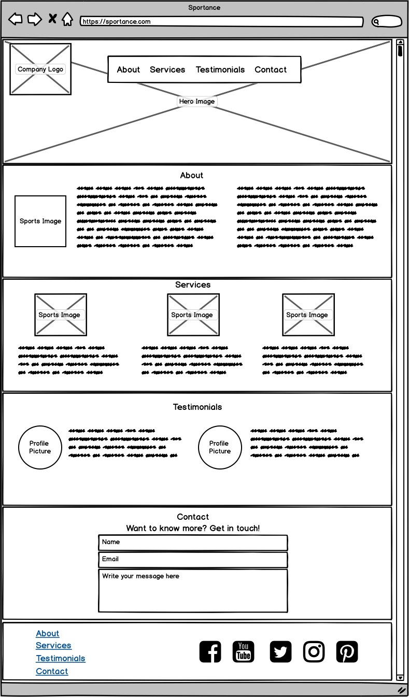
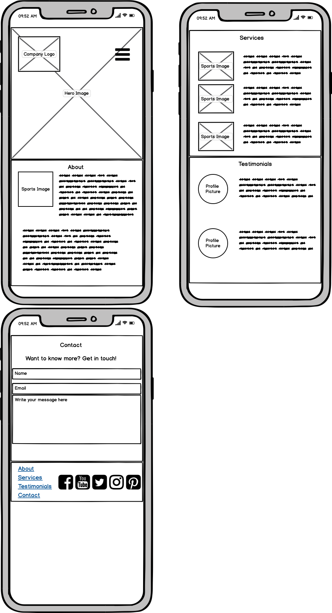
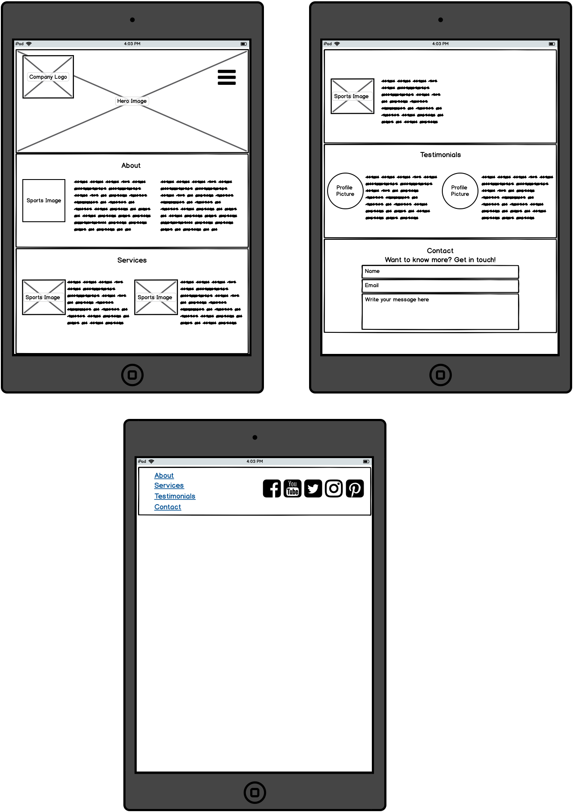

# Sportance - Milestone Project 1

## Introduction
---

A website that is designed to bring Sports Psychology to life through the business of Sportance. Many people are still unaware that Sport Psychology exists and therefore have a lot of questions and want to know more. Sportance is designed to give every user the information that they need by answering the most common questions that get asked. It is a staic website that will give the users enough information to decide whether Sport Psychology is a tool for them or not. It is a safe space that users can easily navigate their way around in order to give them relevant and up to date information.
 
## UX
---
This website is designed for a variety of users such as athletes, other Sport Psychology professional and me the developer. Each user will have different reasons for using the website and what they hope to gain from it. For example, it could an athlete who is struggling in sport and is looking for some professional help. On the other hand, it could be another Sport Psychology professional who is looking for some help and guidance themselves and have therefore sort to seek some help from another professional. 

### User Stories

*Generic User (athlete or sports person)*

* As a user, I want to be able to learn about Sport Psychology and its benefits.
* As a user, I want to be able to identify if they have a need for the services offered.
* As a user, I want to be able to read testimonials from previous clients and decide if they wish to use Sport Psychology for their own personal needs.
* As a user, I want to be able to get in contact with the Sport Psychologist, ask questions and request an appointment.
* As a user, I want to be able to find the social networks of Sportance.

*Other Sport Psychologists*

* To stay up to date with current information.
* To gain inspiration for tools and services that they could use with their own clients.
* To be able to get in contact and ask questions. 

### Design 
1. **Logo** 

The logo was created using [Free Logo Maker](https://logomakr.com) and was designed to be simple and effective. The aim was for the users to look at the logo and understand the purpose of the website and company straight away. The colors on the logo are inine with the color scheme that is shared below to create consistent branding. 

2. **Colour Scheme**

The colours for the website were chosen using [Coolor](https://coolors.co/3c1642-086375-1dd3b0-fffdfd-ffffff) and aim to keep the screen upbeat and refreshing for the users to view. The colours that were choosen are:

*  `#3C1642` - Russian Violet  
*  `#086375` - Blue Saphire
*  `#1DD3B0` - Carribean Green

3. **Fonts**

The website has the main font of Lato, which was chosen due to it readability for all users. It was chosen using [Google Fonts](https://fonts.google.com/specimen/Lato?sidebar.open&selection.family=Lato) and has a default of Sans Serif. 

4. **Wireframes**

The wireframes for this website where created using [Balsamiq](https://balsamiq.com/wireframes/?gclid=CjwKCAjwltH3BRB6EiwAhj0IUBrAHe-2BiRjQmQGSO-FZIjoEjkckL_kVyJXd5ShGVwKqDaDMqKjvBoCQksQAvD_BwE)

## Features
---

 
### Existing Features

The features that were added to the project were designed to have a high level of usability.

* The logo is wrapped in an anchor tag with the link to the Sportance page. This allows it to be used as a refresh for the page should the user need to.
* The menu bar at the top will allow the users to easily navigate around the webpage should they chose not to scroll through the whole page to find the section they are looking for. 
* A menu icon is used in phone view so that is does not overcrowd the header and hero image.
* A hero image was added to make the webpage inviting to the user and make the website self explanatory.
* An About section was used to give the user all the information they need about the webpage and its purpose. A sports image was added to this section to keep in with the design of the rest of the webpage and make it more pleasing to view for the users.
* A services section was used to allow the users to decide whether the services suit their needs and that could be of use to them. This section also allows other Sport Psychology professionals to view what they could potentially add to their services. Images of the types of services were added to tie in with the rest of the webpage.
* A testimonials section was used to allow the users to see the previous work carried out by the Sport Psychology and again decide if they want to access the help on offer. Image of the athletes who have given a testimonial were added so the user could picture who was saying them.
* A contact section was used to allow users to get in touch should they have any questions about the services or Sport Psychogy in general.
* Within the footer are links to each section should the user wish to quickly navigate their way back to a certain section. There is also links to the social media pages that Sportance uses. 

### Features Left to Implement

* A video library where users can access mediation materials that they can use at home. 
* A useful links section that allows users to directly access useful information about Sport Psychology sourced on other websites.

## Technologies Used
---
### **Languages:**

* HTML
* CSS
* jQuery  

### **Frameworks and Libraries**

* [Bootstrap](https://getbootstrap.com/)
* [Font Awesome](https://fontawesome.com/)
* [Favicon Creator](https://www.favicon.cc/?action=import_request)
* [Google Fonts](https://fonts.google.com/specimen/Lato?sidebar.open&selection.family=Lato) 
* [Coolors](https://coolors.co/3c1642-086375-1dd3b0-fffdfd-ffffff) 
* [Balsamiq](https://balsamiq.com/wireframes/?gclid=CjwKCAjwltH3BRB6EiwAhj0IUBrAHe-2BiRjQmQGSO-FZIjoEjkckL_kVyJXd5ShGVwKqDaDMqKjvBoCQksQAvD_BwE)
* [Free Logo Maker](https://logomakr.com)
* [Gitpod Online IDE](https://www.gitpod.io/)
* [Github](https://github.com/)

## Testing
---

## Deployment
---

The webpage was developed using Gitpod IDE and was commited and pushed to a Github repository. The steps below were used to deploy my webpage.

1. Go to [Github](https://github.com/) 
2. Search for [Ted-Williams/Sportance](https://github.com/Ted-Williams/Sportance)
3. Select **settings** from the menu at the top of the page.
4. Scroll down to **GitHub Pages section**.
5. Click on the **dropdown menu** with in the source section and **select master branch**.
6. Click **save**.

The webpage can be found here: [Sportance](https://ted-williams.github.io/Sportance/.)

To create a local respository, follow the steps below:

1. Navigate to [Ted-Williams/Sportance](https://github.com/Ted-Williams/Sportance)
2. Below the menu **click Clone**.
3. Copy the URl using the **clipboard** to the righthand side.
4. Open you preferred IDE for example Gitpod.
5. Type **git clone** into the terminal and paste the respository URl.
6. **Click enter** and the clone will be created. 

## Credits
---

### Content

 * All content written in the About, Services and Testimonials section were written by me. 

### Media

* All images used were taken from [Google](www.google.com) and a grayscale filter applied to all.

### Acknowledgements

* The navbar collapse function was created using the following tutorial [Navbar Collapse Tutorial](https://www.youtube.com/watch?v=L0uNai3XyKQ)
* The contact form was created using the [w3schools Contact Form Guide](https://www.w3schools.com/howto/howto_css_contact_form.asp)

* I would like to thank **Simen Dehlin** for his continued support, help and words of encouragement throughout this project. 
* I would also like to thank the **slack community** at the Code Institute for the help with peer review when needed. 

 ***This project is fictitous and was created for educational purposes as part of the Code Institute Milestone Project 1***